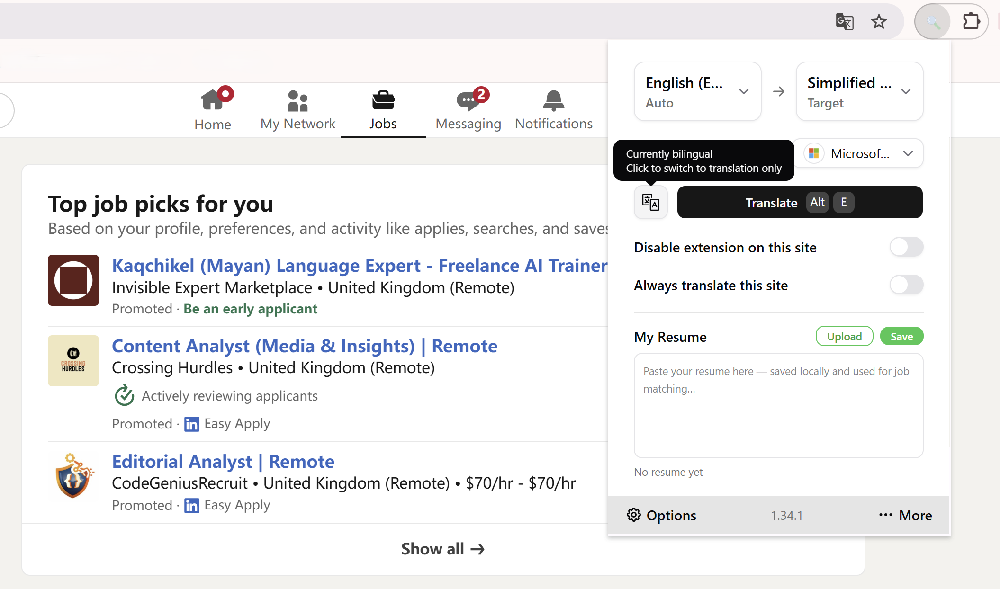
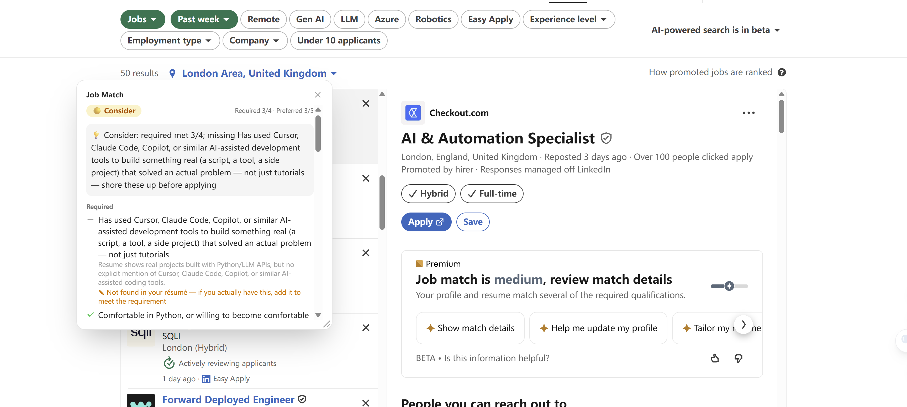
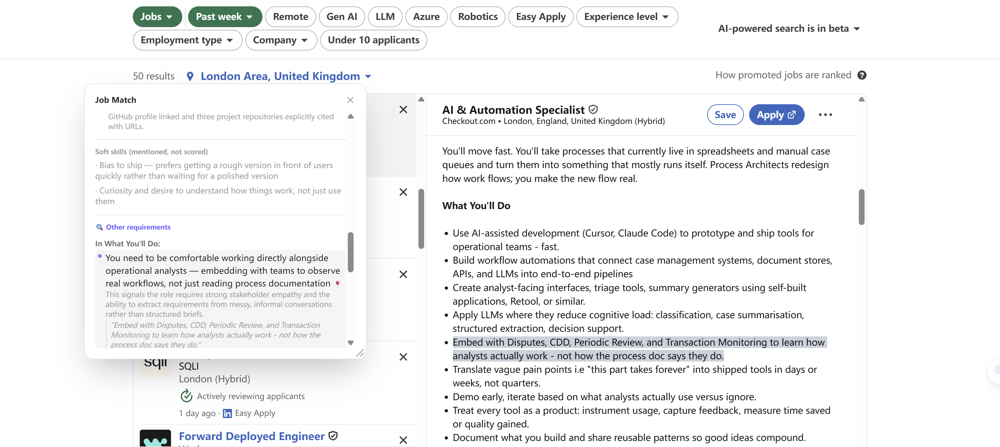
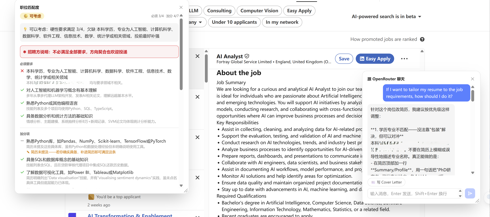
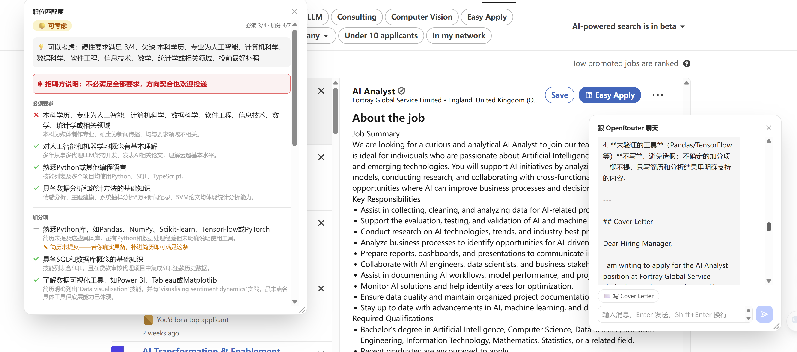

# Job Hunter

A browser extension that helps you read **and judge** English job posts.
On any job page it gives you **inline bilingual translation** plus an **honest, requirement-by-requirement match score** against your own résumé — so you can decide *"is this worth applying to?"* in seconds.

Built for non-native speakers job-hunting abroad. Forked from the open-source [Read Frog](https://github.com/mengxi-ream/read-frog) and extended with an original job-matching feature.

<p align="center">
  
</p>

<p align="center">
  
  
</p>

<p align="center">
  
  
</p>

## Why

Tools like LinkedIn Premium or Jobscan tend to **inflate** your fit — a few overlapping skill tags and you're a "medium match", so you waste time applying to roles you don't qualify for. This extension does the opposite: it reads the **actual requirements** and tells you, honestly, when to **skip**.

## Features

- 🟢 **Honest match scoring** — extracts the job's real requirements, checks each against your résumé, and gives a 🟢/🟡/🔴 verdict driven by the **must-have** requirements (not vanity metrics).
- 🔍 **Hidden ("other") requirements** — mines the expectations buried *outside* the formal Requirements section — in responsibilities, culture, work-mode — and groups them by JD section. Things like *"freelance / contract"*, *"3 days/week in office"*, or a tool that only appears in the responsibilities are easy to miss; this surfaces them.
- 📍 **Click-to-locate on the page** — click any "other" requirement and the extension scrolls to and **grey-highlights the exact sentence** in the original job post, via script-positioned overlay blocks scoped to the job-post container — works even on sites whose CSP silently blocks style-tag-based highlighting.
- ✎ **Résumé-gap hints** — when a requirement is *unclear* (not found in your résumé rather than clearly failed), it's flagged as *"add this to your résumé if you actually have it"* — turning the checklist into a résumé to-do list.
- 🚫 **Deal-breaker awareness** — true gating requirements (a required language, work authorization, a legal licence) are tagged as **deal-breakers** and force a 🔴, while wording like *"a degree is ideal"* is auto-downgraded to nice-to-have so it doesn't unfairly sink the score.
- 💬 **Context-aware AI chat** — a floating chat panel that already knows the job post, your résumé, and your match result; ask it follow-up questions, or have it draft a **cover letter** tailored to this specific role with one click.
- 🔤 **Inline bilingual translation** — original + translation, paragraph by paragraph; handles dynamic pages like LinkedIn (inherited from Read Frog).
- 📄 **Paste your résumé** — stored locally and reused for every match.
- 🌍 **Follows your browser language** — UI *and* the analysis output are in English / 中文 / 日本語 automatically.
- 🔒 **Your keys, your data** — bring your own LLM key (DeepSeek, OpenRouter/Claude, …); résumé stays in local storage.

## How the matching works

The score is **not** keyword overlap (ATS-style). It's a multi-step LLM pipeline designed to be faithful and hard to fool, with a **transparent rule** — not the model — making the final call:

1. **Extract requirements (JD only)** — the model reads only the job post and lists each qualification *faithfully* (keeps "3+ years", degree + field, specific tools), tagging each as **must / nice**, **hard (verifiable) / soft (e.g. "attention to detail")**, and **deal-breaker / not**. Doing this without the résumé in context avoids cherry-picking requirements the résumé happens to match. Preferred-wording ("ideal", "a plus", "nice to have") is forced to *nice* even when it sits in a "Must have" list.
2. **Match against the résumé** — each **hard** requirement is judged `yes / no / unclear` against the full résumé, conservatively (no evidence → not a yes). Soft, unverifiable traits are shown but **never scored**.
3. **Mine the "other" requirements (JD only)** — a separate pass reads the rest of the post and pulls out expectations hidden outside the Requirements section, each backed by a **verbatim quote** from the JD (the quote is validated against the page text, which both blocks hallucination and powers the click-to-locate highlight).
4. **Verdict by rule** — must-dominant: all musts met → 🟢; ≤ half → 🔴; in between, strong nice-to-haves can lift it to 🟢. A failed **deal-breaker** overrides everything → 🔴. Because the colour comes from a rule over the checklist, *"why this verdict"* is always explainable.

The job post's content container is located with a selector strategy that falls back to a title-anchor search (e.g. "About the job") when a site's markup/class names change — the same resilient container is reused to scope the on-page highlight, so a short fuzzy match can't land on a sidebar or nav item. The highlight itself resolves a model-returned quote to a real DOM `Range` by walking text nodes and matching on normalised text (tolerant of curly quotes, dashes and whitespace), then paints it as script-positioned overlay blocks — not the CSS Custom Highlight API, since that API's required `<style>` injection is silently blocked by some sites' CSP.

## Tech stack

WXT · React · TypeScript · Vercel AI SDK (multi-provider LLM) · Tailwind · `@wxt-dev/i18n`.

## Local development

```bash
pnpm install
pnpm dev          # dev with hot reload
pnpm build        # production build → .output/chrome-mv3
```
> On Windows, if `pnpm install`'s postinstall step errors, run it manually:
> `$env:WXT_SKIP_ENV_VALIDATION="true"; pnpm exec wxt prepare`

Then load `.output/chrome-mv3` as an unpacked extension (`chrome://extensions` or `edge://extensions` → Developer mode → Load unpacked).

## Credits & license

Based on the excellent open-source **[Read Frog（陪读蛙）](https://github.com/mengxi-ream/read-frog)** — its translation engine, dynamic-page handling, and provider infrastructure are the work of the original project and its contributors. Original readme preserved as [README.read-frog.md](./README.read-frog.md).

Licensed under **GPL-3.0**, same as upstream. See [LICENSE](./LICENSE).
