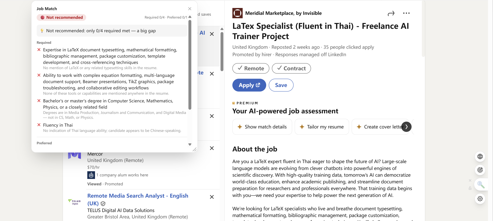
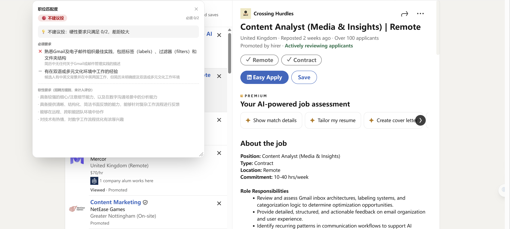

# 找工作神器 · Job Hunter

A browser extension that helps you read **and judge** English job posts.
On any job page it gives you **inline bilingual translation** plus an **honest, requirement-by-requirement match score** against your own résumé — so you can decide *"is this worth applying to?"* in seconds.

Built for non-native speakers job-hunting abroad. Forked from the open-source [Read Frog](https://github.com/mengxi-ream/read-frog) and extended with an original job-matching feature.

<p align="center">
  
</p>

<p align="center">
  
  
</p>

## Why

Tools like LinkedIn Premium or Jobscan tend to **inflate** your fit — a few overlapping skill tags and you're a "medium match", so you waste time applying to roles you don't qualify for. This extension does the opposite: it reads the **actual requirements** and tells you, honestly, when to **skip**.

## Features

- 🟢 **Honest match scoring** — extracts the job's real requirements, checks each against your résumé, and gives a 🟢/🟡/🔴 verdict driven by the **must-have** requirements (not vanity metrics).
- 🔤 **Inline bilingual translation** — original + translation, paragraph by paragraph; handles dynamic pages like LinkedIn (inherited from Read Frog).
- 📄 **Résumé from paste or file** — paste text, or upload **PDF / Word / .txt** (parsed locally).
- 🌍 **Follows your browser language** — UI *and* the analysis output are in English / 中文 / 日本語 automatically.
- 🔒 **Your keys, your data** — bring your own LLM key (DeepSeek, OpenRouter/Claude, …); résumé stays in local storage.

## How the matching works

The score is **not** keyword overlap (ATS-style). It's a two-step LLM pipeline designed to be faithful and hard to fool:

1. **Extract requirements (JD only)** — the model reads only the job post and lists each qualification *faithfully* (keeps "3+ years", degree + field, specific tools), tagging each as **must / nice** and **hard (verifiable) / soft (e.g. "attention to detail")**. Doing this without the résumé in context avoids cherry-picking requirements the résumé happens to match.
2. **Match against the résumé** — each **hard** requirement is judged `yes / no / unclear` against the full résumé, conservatively (no evidence → not a yes). Soft, unverifiable traits are shown but **never scored**.
3. **Verdict by rule** — must-dominant: all musts met → 🟢; ≤ half → 🔴; in between, strong nice-to-haves can lift it to 🟢. The colour comes from a transparent rule over the checklist, so *"why this verdict"* is always explainable.

## Tech stack

WXT · React · TypeScript · Vercel AI SDK (20+ LLM providers) · Tailwind · pdfjs-dist & mammoth (résumé parsing) · `@wxt-dev/i18n`.

## Local development

```bash
pnpm install
pnpm dev          # dev with hot reload
pnpm build        # production build → .output/chrome-mv3
```
> On Windows, if `pnpm install`'s postinstall step errors, run it manually:
> `$env:WXT_SKIP_ENV_VALIDATION="true"; pnpm exec wxt prepare`

Then load `.output/chrome-mv3` as an unpacked extension (`chrome://extensions` or `edge://extensions` → Developer mode → Load unpacked).

## Credits & license

Based on the excellent open-source **[Read Frog（陪读蛙）](https://github.com/mengxi-ream/read-frog)** — its translation engine, dynamic-page handling, and provider infrastructure are the work of the original project and its contributors. Original readme preserved as [README.read-frog.md](./README.read-frog.md).

Licensed under **GPL-3.0**, same as upstream. See [LICENSE](./LICENSE).
